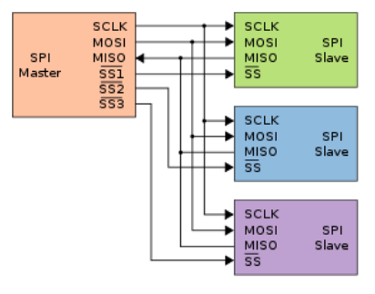

# NOR Flash

* NOR Flash支持Execute On Chip: 程序可以直接在NOR Flash内执行, 在NOR Flash中的代码运行时不需要重定位复制到RAM内. 
* NOR Flash的地址线和数据线分开; 只要提供数据地址, 数据总线会给出正确的数据
* 不能直接对NOR Flash进行写操作, 执行写操作之前需要先发送固定的命令序列, 然后发送写操作的地址和数据
* 扇区是NOR Flash擦除的最小单位; 每个扇区的大小不是固定的 

# AHB总线

# CoreDump, CrushDump

# SPI, I2C, UART三种串行总线

简述

* SPI(Serial Peripheral Interface, **串口外设接口**), 是Motorola公司提出的一种**同步串行数据**的总线标准
* I2C, 又称IIC(Inter Ic Bus, **IC间总线**), 是由PHILIPS公司开发的**两线式串行总线**, 用于连接微控制器及其外围设备, 是微电子通信控制领域广泛采用的一种总线标准
* UART(Universal Asynchronoous Receiver Transmitter, **通用异步收发器**), 俗称"串口", 通常被集成于其他通讯接口的连接上

SPI, I2C, UART的对比

| 对比项       | UART                                          | SPI                                                          | I2C                                                          |
| ------------ | --------------------------------------------- | ------------------------------------------------------------ | ------------------------------------------------------------ |
| 信号线       | RX, TX, GND                                   | SDO, SDI, SCLK, SS                                           | SDA, SCLK                                                    |
| 设备从属关系 | 无                                            | 存在主从设备; SPI用**片选信号**选择从机                      | 存在主从设备; I2C用**地址**选择从机                          |
| 通信方式     | 全双工                                        | 全双工                                                       | 半双工                                                       |
| 应用领域     | 1.控制计算机与串行设备的芯片 2.调试      | EEPROM, FLASH, 实时时钟, AD转换器, 还有数字信号处理器和数字信号解码器之间 | 在同一个板子上的2个IC之间的通信, 可以替代标准的并行总线, 连接各种集成电路和功能模块 |
| 传输距离     |                                               |                                                              | I2C需要有双向IO的支持, 而且使用上拉电阻, 抗干扰能力较弱, 一般用于同一板卡上芯片之间的通信, 较少用于远距离通信 |
| 通信特征     | 异步, 一帧可以传5~8个数据位. 从最低位开始传送 | 同步, SPI允许数据逐位传送, 甚至允许暂停. 从最高位开始传送    | 同步, 电平信号, 一次连续8位. 从最高位开始传送                |
| 协议复杂度   | 结构较复杂                                    | SPI实现比UART简单                                            | UART协议比SPI复杂                                            |
| 对比         |                                               | 在点对点的通信中, SPI接口不需要进行寻址操作, 且为全双csqi工通信, 简单高效. 在多个从件的系统中, 每个从件需要独立的使能信号, SPI硬件上比I2C系统要稍微复杂一些 |                                                              |

## SPI

SPI连接的示意图

说明

* 四条信号线: 串行时钟线(SCLK), 串行数据输出线(SDO), 串行数据输入线(SDI), 片选线(SS). 所谓的输出输入, 是针对信号进出设备而言的
* SPI总线可以实现多SPI设备互相连接. 提供时钟的SPI设备为主设备, 其他设备为从设备. SCLK信号线只由主设备控制, 从设备不能控制信号线
* 在SPI总线上, 某一时刻可以出现多个从机, 但只能存在一个主机. 主机通过片选线来确定要通信的从机. 这就要求从机的MISO口线具有三态特性, 使得该口在从机未被选通时表现为高阻抗
* 主从设备间快车实现全双工通信, 收发独立, 操作简单, 数据传输速率较高, 单需要占用主机较多的口线(每个从机都需要一根片选线), 而且只支持单个主机, 没有指定的流控制, 没有应答机制确认是否接收到数据
* 数据输出通过SDO线, 数据在时钟上沿或下沿时发送, 在紧接着的下沿或上沿被读取, 从耳完成一位数据传输. 数据输入也使用同样原理. 因此, 8位数据的传输, 至少需要8次时钟信号的改变(上沿和下沿为一次)
* 通常的串行通讯一次连续传送至少8位数据, 而SPI允许数据一位一位的传送, 甚至允许暂停, 因为SCLK时钟线由主控设备控制, 当没有时钟跳变时, 从设备不采集或传送数据. 也就是说, 主设备通过对SCLK时钟线的控制可以完成对通讯的控制
* SPI接口在CPU和外围低速器件之间进行同步串行数据传输, 在主器件的移位脉冲下, 数据按位传输, 高位在前, 低位在后

### 数据传输

SPI在数据传输时, 需要确认两件事情

1. 数据是在时钟的上升沿采集还是下降沿采集
2. 时钟的初始(空闲)状态是高电平还是低电平

CPOL和CPHA

* CPOL(时钟极性): 表示